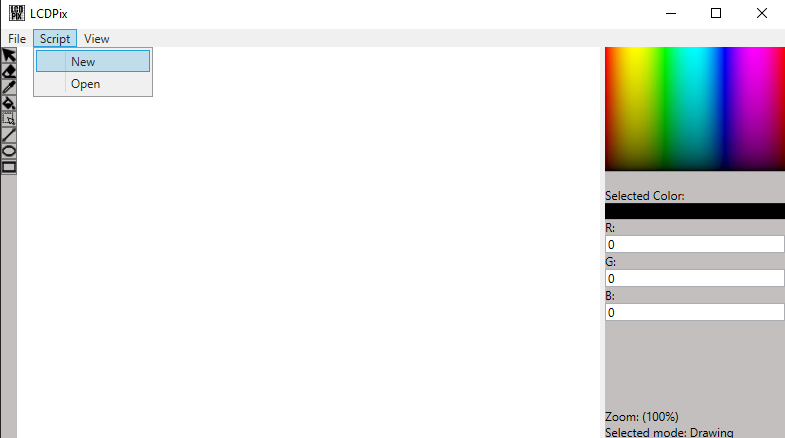
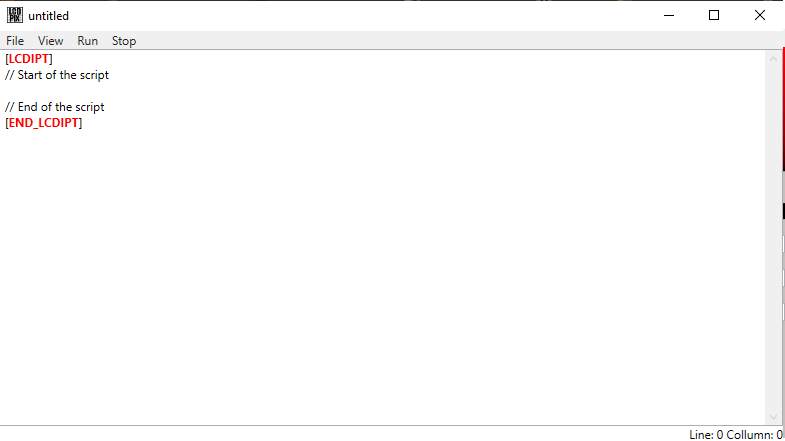

# LCDPix    
### [Open Latest Release](https://github.com/MurkyYT/LCDPix/releases/latest).
### [Download Latest Release](https://github.com/MurkyYT/LCDPix/releases/latest/download/LCDPix.exe).
LCDPix is an app in which you can draw and create scripts that will draw for you!

## LCDPix scripts - How to use
* Here is the list of all the functions:
  - Create(Width,Height,PixelSize) - create new file
  - Grid(true/false) - turn on/off grid
  - Zoom(amountOfZoom) - change zoom
  - Draw(x,y) - draw one pixel
  - Fill(x,y) - fills the pixels with the same color around
  - Rectangle(x1,y1,x2,y2) - create a rectangle
  - Ellipse(x1,y1,x2,y2) - create an ellipse
  - Line(x1,y1,x2,y2) - create a line
  - Color(RedValue,GreenValue,BlueValue) - change color
  - Wait(time in ms) - wait for the specified amount of time before continuing to run the script
  - Undo() - undo last action
  - Redo() - redo last action
* To create a new script you press the script menu and new
  
  - After that you can write in the editor field:  
  
* To run the script press Run on the script editor menu
### Example script
[example.lcdipt](https://github.com/MurkyYT/LCDPix/blob/master/Scripts/example.lcdipt)  
Demonstration of it:  

